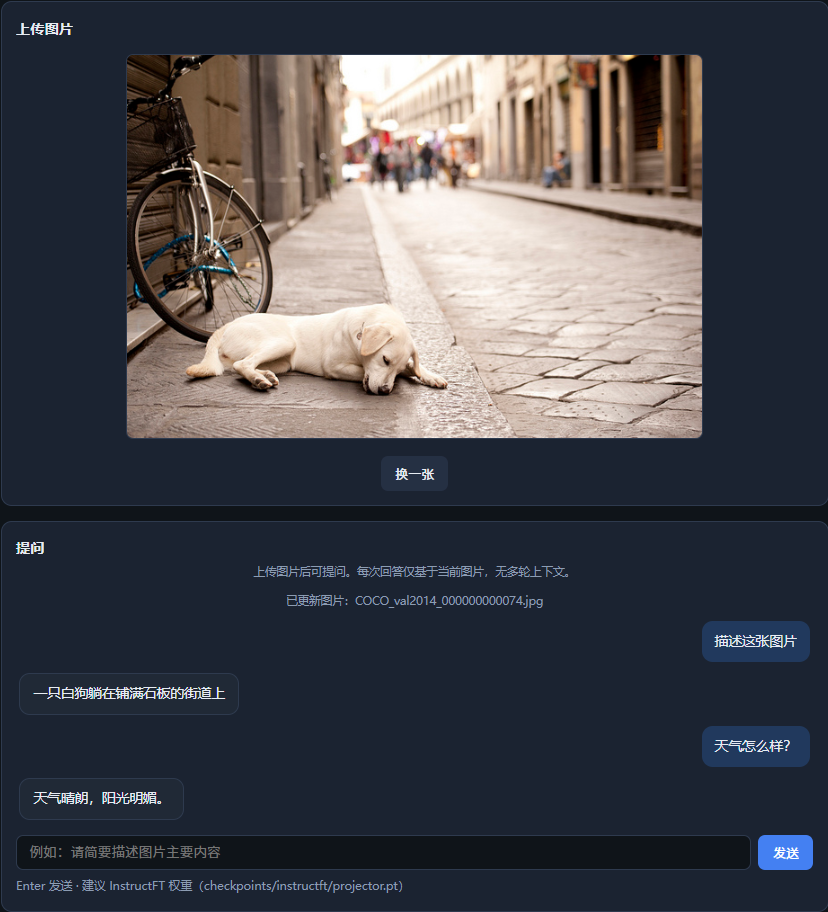
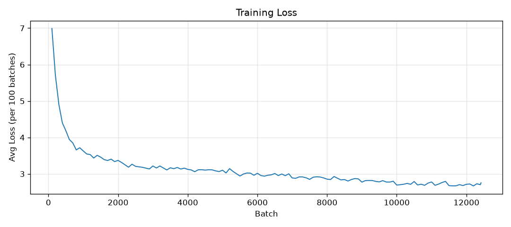
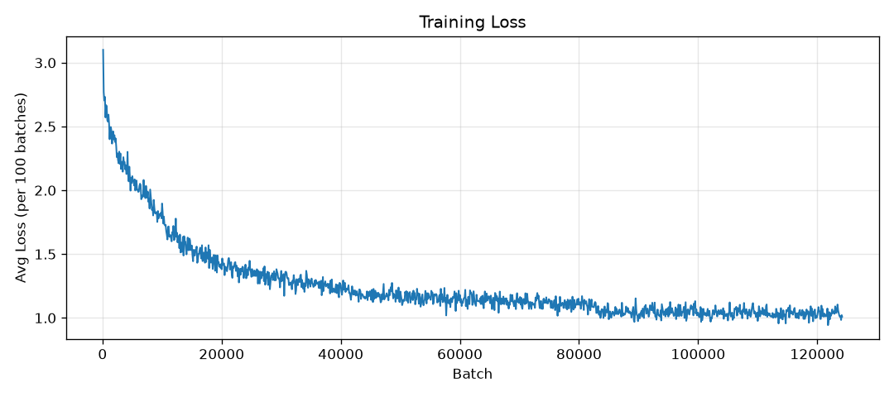
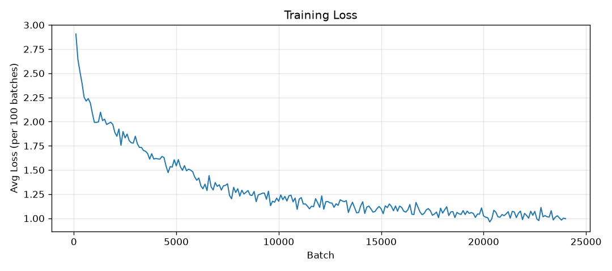

# VLM v1：自己训练一个视觉语言模型

视频讲解：[哔哩哔哩 · 本项目完整流程](https://www.bilibili.com/video/BV1ktTy67Eqx)

<p align="center">
  
</p>

---

## 整体流程（Step 0 → 8）


| 步骤  | 环节         | 内容                                            |
| --- | ---------- | --------------------------------------------- |
| 0   | 环境         | 安装 conda 环境与 Python 依赖                        |
| 1   | 数据         | 下载 COCO 图片与 COCO-CN 中文标注                      |
| 2   | vLLM 与模型准备 | 下载各模型权重，启动 Qwen3.5 推理服务                       |
| 3   | 训练数据       | 构建 Align 语义对齐与 InstructFT 指令微调问答数据（仓库已附带，可跳过） |
| 4   | 模型架构       | 定义 SigLIP + Projector + Qwen 组合结构             |
| 5   | 训练         | 两阶段训练 Projector（Align 语义对齐 → InstructFT 指令微调） |
| 6   | 命令行测试      | 抽样图片做看图问答冒烟测试                                 |
| 7   | Web 界面     | 浏览器上传图片、在线逐条提问                                |
| 8   | 模型评估       | 抽图清单（一次）→ Qwen3.5 出题与裁判，量化 Align / InstructFT |


---


## 仓库结构

```
VLM/
├── data/qa/                              # 训练问答 JSON
├── models/
│   ├── vlms/                             # VLM 定义
│   └── demo/                             # 各组件单独验证
├── utils/                                # 数据构建、训练日志
├── scripts/                              # 训练与测试
├── web/                                  # Web 界面
├── eval/                                 # 评估脚本
├── checkpoints/
│   ├── semantic_align/projector.pt       # Align 权重
│   └── instructft/projector.pt           # InstructFT 权重
├── logs/                                 # 训练记录
└── requirements.txt
```

---


## Step 0：环境


| 组件      | 版本           |
| ------- | ------------ |
| Python  | 3.12         |
| CUDA    | 13.0（cu130）  |
| PyTorch | 2.11.0+cu130 |
| vLLM    | ≥ 0.8.5      |


```bash
conda create -n vlm python=3.12 -y && conda activate vlm
cd VLM
pip config set global.cache-dir $(pwd)/.pip-cache
pip install -r requirements.txt
```

pip 缓存目录：`VLM/.pip-cache/`（数据盘，不占系统盘）

若某包下载慢或超时，可先单独下载 wheel 到 `wheels/` 再安装，例如 `numpy`：

```bash
mkdir -p wheels
pip download numpy==2.3.5 -d wheels \
  -i https://pypi.tuna.tsinghua.edu.cn/simple \
  --python-version 3.12 --only-binary=:all:
pip install wheels/numpy-*.whl
pip install -r requirements.txt
```

**验证环境**

```bash
python -c "import torch; print(torch.__version__); print(torch.version.cuda); print(torch.cuda.is_available()); print(torch.cuda.get_device_name(0))"
```

预期类似（GPU 型号因机器而异）：

```
2.11.0+cu130
13.0
True
NVIDIA GeForce RTX 5090
```

---


## Step 1：数据

**1.1 COCO2014 图片** — [ModelScope 下载](https://www.modelscope.cn/datasets/OmniData/COCO_2014/tree/master/raw)

```bash
mkdir -p data/COCO2014/raw
modelscope download --dataset OmniData/COCO_2014 raw/train2014.zip --local_dir data/COCO2014
modelscope download --dataset OmniData/COCO_2014 raw/val2014.zip --local_dir data/COCO2014
unzip data/COCO2014/raw/train2014.zip -d data/COCO2014
unzip data/COCO2014/raw/val2014.zip -d data/COCO2014
```

本地规模：`train2014` 82,783 张 · `val2014` 40,504 张。

**1.2 COCO-CN 标注** — [HuggingFace](https://huggingface.co/datasets/AIMClab-RUC/COCO-CN)

```bash
wget -c -O data/COCO2014/coco-cn-version1805v1.1.tar.gz \
  "https://huggingface.co/datasets/AIMClab-RUC/COCO-CN/resolve/main/coco-cn-version1805v1.1.tar.gz?download=true"
tar -xzf data/COCO2014/coco-cn-version1805v1.1.tar.gz -C data/COCO2014
```

若 HuggingFace 下载慢，可改用 hf-mirror：

```bash
wget -c -O data/COCO2014/coco-cn-version1805v1.1.tar.gz \
  "https://hf-mirror.com/datasets/AIMClab-RUC/COCO-CN/resolve/main/coco-cn-version1805v1.1.tar.gz?download=true"
tar -xzf data/COCO2014/coco-cn-version1805v1.1.tar.gz -C data/COCO2014
```

---


## Step 2：vLLM与模型准备

**下载模型（首次）**

```bash
mkdir -p models
modelscope download --model Qwen/Qwen3.5-9B --local_dir models/Qwen3.5-9B
modelscope download --model google/siglip2-so400m-patch16-384 --local_dir models/siglip2-so400m-patch16-384
modelscope download --model Qwen/Qwen3-1.7B --local_dir models/Qwen3-1.7B
```

**5090 + FlashInfer（首次）**

```bash
conda activate vlm

pip install --force-reinstall --no-deps \
  nvidia-cuda-nvcc==13.0.88 \
  nvidia-cuda-crt==13.0.88 \
  nvidia-nvvm==13.0.88 \
  nvidia-cuda-cccl==13.0.85

# 报错 RuntimeError: FlashInfer requires GPUs with sm75 or higher 的解决方案（cuda13.0版本的错误）
export CUDA_HOME=$CONDA_PREFIX/lib/python3.12/site-packages/nvidia/cu13
ln -sf libcudart.so.13 $CUDA_HOME/lib/libcudart.so
```

JIT 编译报错时：`rm -rf ~/.cache/flashinfer`

**启动（每次 Step 3.2 前）**

```bash
conda activate vlm

export CUDA_HOME=$CONDA_PREFIX/lib/python3.12/site-packages/nvidia/cu13
export PATH=$CUDA_HOME/bin:$PATH
export LD_LIBRARY_PATH=$CUDA_HOME/lib:$LD_LIBRARY_PATH
export LIBRARY_PATH=$CUDA_HOME/lib:$LIBRARY_PATH
ln -sf libcudart.so.13 $CUDA_HOME/lib/libcudart.so

vllm serve models/Qwen3.5-9B --port 8033 --reasoning-parser qwen3 \
  --max-model-len 2048 \
  --gpu-memory-utilization 0.80
```

看图出题 / 评测的图文 prompt 很短，无需模型默认的 262144 上下文；加上 `--max-model-len 2048` 可大幅减小 KV cache，避免在较低 `gpu-memory-utilization` 下启动失败。

**测试**

curl 中 `model` 用本地路径 `models/Qwen3.5-9B`（与 `vllm serve` 一致）。默认关闭推理：`chat_template_kwargs.enable_thinking: false`。

采样参数：`temperature` 越高越随机、越低越稳；`top_p` 从累积概率达 p 的候选词中采样；`top_k` 只保留概率最高的 k 个候选词。

```bash
curl http://localhost:8033/v1/chat/completions \
  -H "Content-Type: application/json" \
  -d '{
    "model": "models/Qwen3.5-9B",
    "messages": [{"role":"user","content":"你好"}],
    "temperature": 0.7,
    "top_p": 0.8,
    "top_k": 20,
    "max_tokens": 2048,
    "chat_template_kwargs": {"enable_thinking": false}
  }'
```

测试脚本（`models/demo/`）：

```bash
cd VLM
python models/demo/qwen3_5_9b.py   # 需先启动 vLLM 服务
python models/demo/qwen3_1_7b.py   # vLLM 占用 GPU 时需先停服务
python models/demo/siglip2.py
```

---


## Step 3：构建训练数据（可选）

仓库已附带 `data/qa/` 下两份 JSON，可直接 Step 5 训练。仅当需要重新生成或修改问法时再跑本节。

### 3.1 构建语义对齐训练数据

COCO-CN `#0` caption + 固定问题「请简要描述图片主要内容」→ `data/qa/coco_cn_qa.json`

```bash
python utils/step3_build_coco_cn_qa.py
```

单条样本示例：

```json
{
  "image": "data/COCO2014/train2014/COCO_train2014_000000000036.jpg",
  "question": "请简要描述图片主要内容",
  "answer": "一个年轻女子拿着一把粉红色的太阳伞"
}
```


### 3.2 构建指令微调训练数据

Qwen3.5 看图生成：每图 2 问（10 种描述问法随机 1 + 自拟细节问），生成 `data/qa/coco_train_qa_qwen3.5.json`。

```bash
# 需要提前用vLLM启动qwen3.5-9B
python utils/step3_generate_qa.py --num-images 10   # 试跑
python utils/step3_generate_qa.py --num-images 0    # 全量 train2014
```

生成完成后停 vLLM，再训练。

### 数据对比


|     | 语义对齐               | 指令微调                         |
| --- | ------------------ | ---------------------------- |
| 文件  | `coco_cn_qa.json`  | `coco_train_qa_qwen3.5.json` |
| 条数  | 20,341             | 165,566                      |
| 图片  | 20,341（COCO-CN 子集） | 82,783（train 全量）             |
| 问答  | 1 固定问 + 人工 caption | 2 问/图，Qwen3.5 生成             |


---


## Step 4：架构

SigLIP2（视觉）+ Projector（对齐层）+ Qwen3-1.7B（语言），只训练 Projector。


| 模块        | 模型             | 训练     |
| --------- | -------------- | ------ |
| Vision    | SigLIP2-so400m | 冻结     |
| Projector | 2×MLP          | 训练     |
| LLM       | Qwen3-1.7B     | 冻结     |


`<image>` 占位符在序列中展开为 576 个视觉 token（384÷16=24 → 24×24 patch），与文本 embedding 拼接后送入 Qwen。训练时 `max_seq_len=704`（576 图 + 128 文本）。

**数据流举例**（demo 图 + InstructFT 权重实测，B=1）：

```
question = "请用一句话描述这张图片。"
answer   = "客厅里，一位女子正在厨房里。"

prompt（训练时 answer 接在后面，truncate 至 128 token）：
  <|im_start|>system
  {system}
  
  <|im_start|>user
  <image>
  {question}
  
  <|im_start|>assistant
  {answer}

① 视觉路径
  pixel_values          (1, 3, 384, 384)
    → SigLIP Vision     (1, 576, 1152)
    → Projector         (1, 576, 2048)

② 文本 tokenize（T_text=46，含 1 个 <image> 占位 id）
  input_ids             (46,)
    → embed_tokens      (46, 2048)

③ 在 pos=22 处展开 <image>
  prefix  text[:22]     (22, 2048)     system + user 段至 <image> 前
  image   576 视觉 token (576, 2048)  替换 1 个 <image> id
  suffix  text[23:]      (23, 2048)    问题 + assistant 头 + answer
  ────────────────────────────────────
  merged  cat 沿 seq 维  (621, 2048)   621 = 46 - 1 + 576

④ 送入 Qwen3 LLM
  inputs_embeds         (1, 621, 2048)
  labels                (1, 621)       前 611 为 -100，后 10 个 answer 算 loss
    → Causal LM         (1, 621, 151670)

推理（仅 prompt）时 T_text=36 → T_seq=611，generate 再追加新 token。
```

验证：`python models/vlms/VLM_v1_model.py`（需 GPU；vLLM 占用显存时需先停服务）

---


## Step 5：训练

两阶段：Align 语义对齐（COCO-CN 中文描述预热）→ InstructFT 指令微调（Qwen3.5 生成的大规模视觉问答）。推理与 Web 演示请用 InstructFT 权重；Align 数据少、问题单一，单独使用效果较差，主要供 InstructFT 初始化。

prompt labels = `-100`，只对 answer 算 loss；`max_seq_len=704`（576 图 + 128 文本）。

```bash
conda activate vlm

# Align 语义对齐
python scripts/step5_train_vlm_v1.py --stage semantic_align

# InstructFT 指令微调（默认加载 Align 的 projector.pt）
python scripts/step5_train_vlm_v1.py --stage instructft
```


| 阶段              | 说明                  | 数据                                   | 输出                                        |
| --------------- | ------------------- | ------------------------------------ | ----------------------------------------- |
| Align 语义对齐      | COCO-CN 描述对齐视觉与语言空间 | `data/qa/coco_cn_qa.json`            | `checkpoints/semantic_align/projector.pt` |
| InstructFT 指令微调 | 多类视觉问答，学会按问题类型回答    | `data/qa/coco_train_qa_qwen3.5.json` | `checkpoints/instructft/projector.pt`     |


**训练 loss 曲线**

两图横轴均为 Batch，纵轴均为每 100 batch 的平均 loss；因数据量与 loss 尺度不同，坐标范围不一致，不宜横向对比，仅供各阶段内部观察收敛趋势。

<table>
  <tr>
    <td width="50%" align="center">
      Align 语义对齐<br>
      <sub>横轴约 0–1.2 万 batch · 纵轴 loss 约 2.5–7.0</sub>
    </td>
    <td width="50%" align="center">
      InstructFT 指令微调<br>
      <sub>横轴约 0–12 万 batch · 纵轴 loss 约 0.9–3.1</sub>
    </td>
  </tr>
  <tr>
    <td align="center"></td>
    <td align="center"></td>
  </tr>
</table>

```bash
mkdir -p logs/instructft
nohup python scripts/step5_train_vlm_v1.py --stage instructft > logs/instructft/nohup.out 2>&1 &
```


### Step 5b：InstructFT + LoRA（可选）

在 Align projector 基础上，用 InstructFT 数据联合训练 Projector + Qwen attention LoRA（rank=16，运行时挂 adapter，不 merge）。

```bash
python scripts/step5_train_instructft_lora.py
```


| 输出           | 路径                                         |
| ------------ | ------------------------------------------ |
| Projector    | `checkpoints/instructft_lora/projector.pt` |
| LoRA adapter | `checkpoints/instructft_lora/lora/`        |


**训练 loss 曲线**

<p align="center">
  
</p>

---


## Step 6：命令行测试

```bash
python scripts/step6_test_vlm_v1.py                                                          # 默认 InstructFT
python scripts/step6_test_vlm_v1.py --checkpoint checkpoints/semantic_align/projector.pt  # 对比 Align
```

InstructFT + LoRA（Step 5b 权重）：

```bash
python scripts/step6_test_instructft_lora.py \
  --projector checkpoints/instructft_lora/projector.pt \
  --lora-dir checkpoints/instructft_lora/lora
```

VLM_v1 推理（SigLIP2 + Qwen3-1.7B + Projector，bf16）单卡约需 5.4GB 显存；vLLM 占用 GPU 时需先停服务。

---


## Step 7：Web 界面

```bash
conda activate vlm && cd web
python server.py
```

默认 `checkpoints/instructft/projector.pt`，端口 7860。上传图片后逐条提问，无多轮上下文。推理显存约 5.4GB（同 Step 6）。

**访问方式**


| 环境             | 做法                                                          |
| -------------- | ----------------------------------------------------------- |
| 本机 / 公司局域网     | 终端打印 `192.168.x.x:7860`，发给同网同事                              |
| AutoDL（Docker） | `172.17.x.x` 是容器 IP，不能当局域网用 |


---


## Step 8：模型评估

用 Qwen3.5-9B 作出题人与裁判，在验证集上量化 VLM 质量。图片抽样（8.0）只需运行一次，写入 `step8_0_images.json`；后续 8.1 / 8.2 / 8.3 均从 JSON 加载，支持断点续跑。


| 步骤  | 内容                  | 输出                                                   |
| --- | ------------------- | ---------------------------------------------------- |
| 8.0 | 随机抽取测评图片（仅一次）   | eval/outputs/step8_0_images.json                     |
| 8.1 | Qwen3.5 看图出题 + 参考答案 | eval/outputs/step8_1_benchmark.json                  |
| 8.2 | VLM 逐条回答（每题单独推理）    | eval/outputs/step8_2_vlm_answers_{权重名}.json          |
| 8.3 | Qwen3.5 看图裁判打分      | eval/outputs/step8_3_scores_{权重名}.json（由 8.2 路径自动推导） |


**题型与训练阶段对应**


| type     | 含义          | 测评目标                  |
| -------- | ----------- | --------------------- |
| `scene`  | 描述图片主要内容    | Align 语义对齐得分      |
| `detail` | 针对图片细节的自拟问答 | InstructFT 指令微调得分 |


默认从 `val2014` 随机抽 50 张写入 8.0 清单，每张 2 题，共 100 条；`--num-images` 可自定义。重抽须 `step8_0_sample_images.py --force` 并删除后续 JSON。

**前置**

- Step 8.0：仅需本地验证集图片，无需 GPU / vLLM
- Step 8.1 / 8.3：需 vLLM 服务（同 Step 2）
- Step 8.2：需 GPU；VLM_v1 单卡推理约 5.4GB 显存（bf16、batch=1）；须先停 vLLM 释放显存

```bash
conda activate vlm

# 8.0 随机抽图（仅首次或需重抽时运行）
python eval/step8_0_sample_images.py --seed 42

# 启动 Qwen3.5（8.1 / 8.3 用）
export CUDA_HOME=$CONDA_PREFIX/lib/python3.12/site-packages/nvidia/cu13
export PATH=$CUDA_HOME/bin:$PATH
export LD_LIBRARY_PATH=$CUDA_HOME/lib:$LD_LIBRARY_PATH
export LIBRARY_PATH=$CUDA_HOME/lib:$LIBRARY_PATH
ln -sf libcudart.so.13 $CUDA_HOME/lib/libcudart.so

vllm serve models/Qwen3.5-9B --port 8033 --reasoning-parser qwen3 \
  --max-model-len 2048 \
  --gpu-memory-utilization 0.8

# 8.1 生成基准问答（从 step8_0_images.json 读图）
python eval/step8_1_generate_benchmark.py

# 停 vLLM 后 8.2：VLM 逐条回答
python eval/step8_2_vlm_answer.py --checkpoint checkpoints/instructft/projector.pt

# 重启 vLLM（export 同上，再执行 vllm serve）后 8.3：裁判打分（--force 覆盖上一次的打分）
python eval/step8_3_judge_scores.py \
  --input eval/outputs/step8_2_answers_instructft.json \
  --force
```

`--gpu-memory-utilization 0.8` 约预留 5.4GB 给 Step 8.2 VLM_v1 推理。

**评分标准**（五维度，每维 0–20 分，单题满分 100；从严给分）

**scene（Align 语义对齐）**


| 维度        | 说明                        |
| --------- | ------------------------- |
| 主要语义准确性   | 画面核心主题（何处、何人/何物、在做什么）是否正确 |
| 关键元素覆盖    | 是否覆盖图中多个关键可见元素，无明显遗漏      |
| 参考答案语义一致  | 与参考答案核心语义是否等价或高度一致        |
| 事实忠实（无幻觉） | 陈述是否均可从图中验证，无编造           |
| 表达质量      | 中文是否通顺、描述是否清晰             |


**detail（InstructFT 指令微调）**


| 维度        | 说明                  |
| --------- | ------------------- |
| 事实正确性     | 答案事实是否与图中完全一致       |
| 问题理解      | 是否正面、直接回答所问问题       |
| 参考答案语义一致  | 与参考答案语义是否等价（允许措辞不同） |
| 事实忠实（无幻觉） | 是否无图中不存在的信息         |
| 简洁规范      | 是否简短直接，符合细节问答长度预期   |


各维度须为 0–20 任意整数（如 7、11、14、17），按实际表现细粒度给分，禁止机械套用 0/10/20 锚点。分档参考：18–20 几乎无瑕疵 · 14–17 基本正确 · 10–13 部分正确 · 5–9 大部分错误 · 0–4 完全错误或无关。

---

